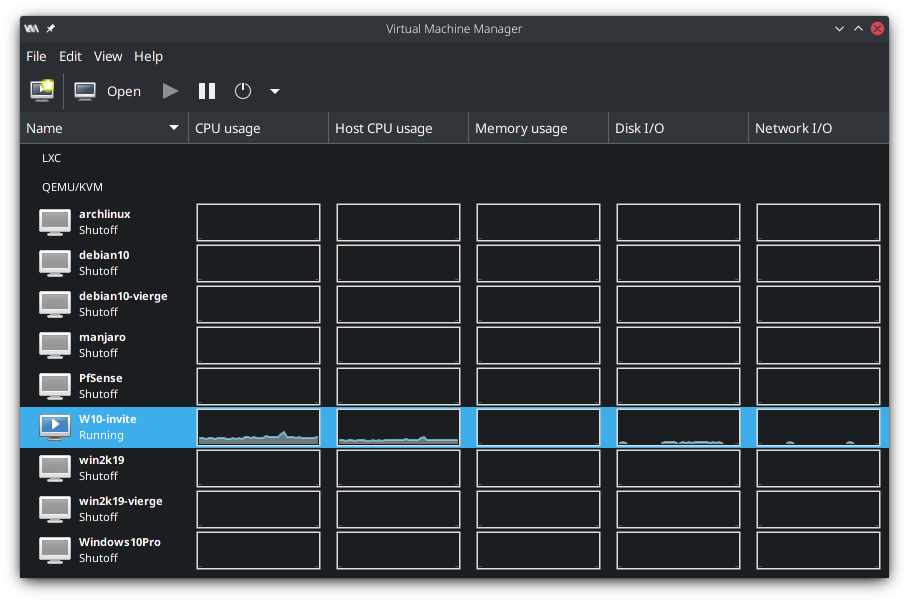
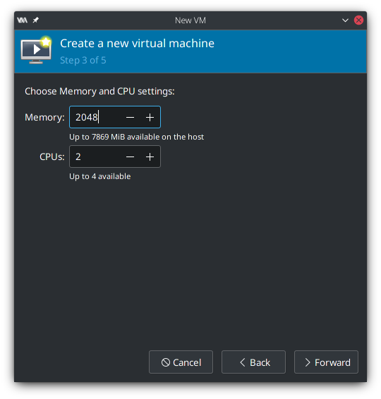
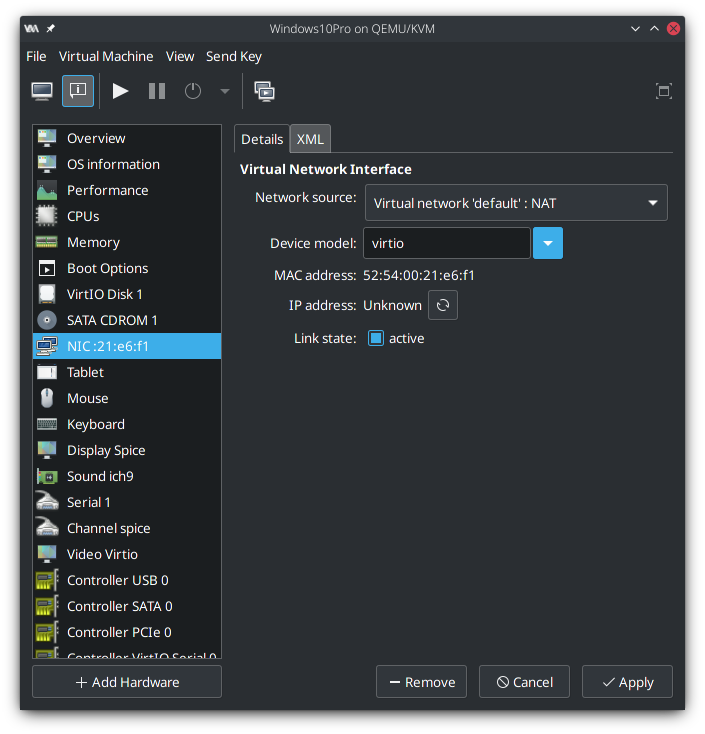
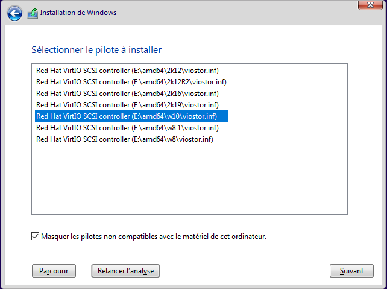
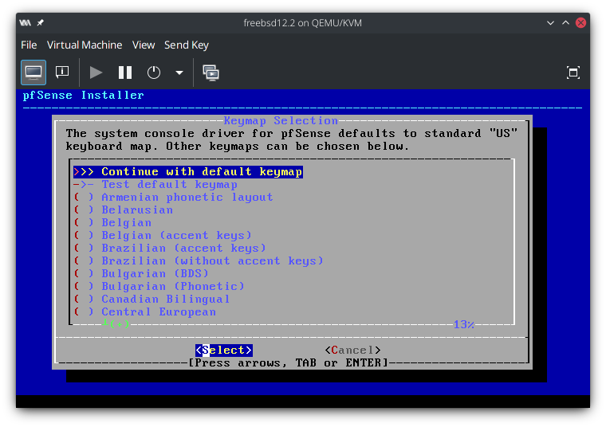
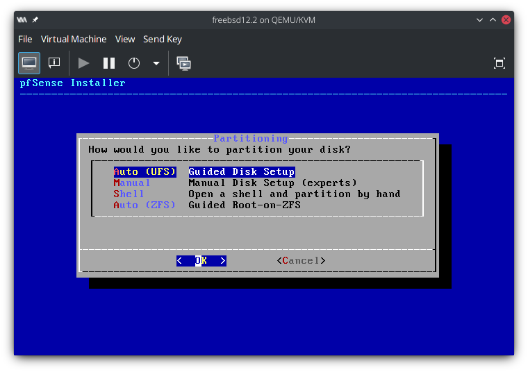
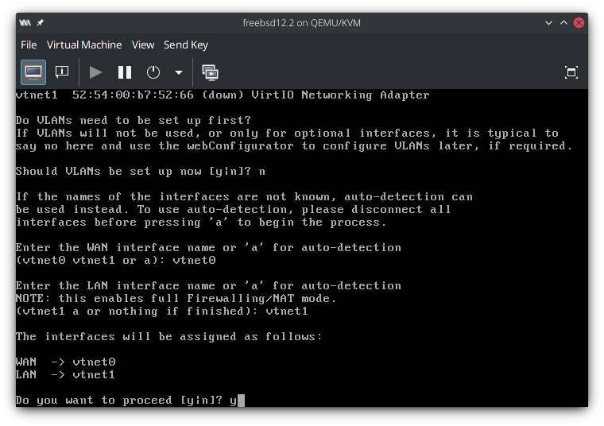
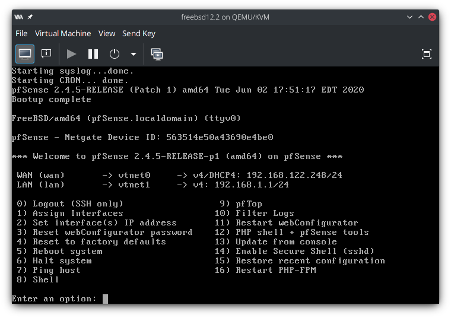

# Mise en place d´une infrastructure virtualisée

- [Mise en place d´une infrastructure virtualisée](#mise-en-place-dune-infrastructure-virtualisée)
  - [Introduction](#introduction)
  - [Adressage réseau](#adressage-réseau)
  - [Pourquoi un hôte Linux ?](#pourquoi-un-hôte-linux-)
  - [Spécifique à Arch Linux](#spécifique-à-arch-linux)
    - [QEMU/KVM](#qemukvm)
    - [VirtualBox](#virtualbox)
      - [Troubleshooting / Guru Meditation](#troubleshooting--guru-meditation)
      - [⚠ Précautions à l´usage](#-précautions-à-lusage)
  - [Optimisations](#optimisations)
    - [Paravirtualisation Virtio et drivers (KVM)](#paravirtualisation-virtio-et-drivers-kvm)
    - [KISS: Keep It Simple, Stupid](#kiss-keep-it-simple-stupid)
  - [Installation des machines virtuelles](#installation-des-machines-virtuelles)
    - [Installer un invité Windows sous KVM](#installer-un-invité-windows-sous-kvm)
      - [Options de la machine](#options-de-la-machine)
      - [Drivers](#drivers)
    - [Installation d'un pare-feu PfSense sous KVM](#installation-dun-pare-feu-pfsense-sous-kvm)
      - [Installation](#installation)
      - [Configuration](#configuration)
      - [Première connexion à l'interface web](#première-connexion-à-linterface-web)
      - [Mises à jour](#mises-à-jour)
      - [Blocage de ports et rules](#blocage-de-ports-et-rules)
    - [Mise en place d'un VPN OpenVPN sur PfSense](#mise-en-place-dun-vpn-openvpn-sur-pfsense)

## Introduction

Ici se trouve à la fois une procédure d´installation de machines virtuelles ainsi que toute une section optimisation.

L´existence d´une section entière dédiée à l´optimisation peut sembler *originale*, mais elle prendra vite tout son sens en vue du contexte.

> Toutes les VM peuvent et arrivent à tourner **CORRECTEMENT**, **SIMULTANÉMENT** sur un ordinateur portable, d´entrée de gamme de **2016**. Il suffit de faire preuve d´un peu d´astuce.

Est utilisé tout au long de cette procédure un Packard Bell embarquant :

- Intel Core i3-5005U, Dual-Core, 4 threads @1.9GHz
- 8GB DDR3L @1600MHz
- SSD SATA 500GB

Les commandes et instructions tout au long de la procédure sont données pour Arch Linux. Il sera nécessaire de les ajuster en fonction de la distrbution utilisée !

## Adressage réseau

Pour des raisons pûrement pratiques (mais aussi techniques), le réseau WAN n'est pas simplement bridgé sur l'interface réseau. Celà ne change en rien le fonctionnement et au contraire, évite de péter un câble si on change de connectivité sur l'hôte.

Notre partie de réseau WAN arrivant sur le PfSense est sur un réseau fixe `192.168.50.0/24` peut-importe ce qui est derrière (Ethernet, Wi-Fi, 4G).

La partie LAN derrière le PfSense est elle sur un réseau en `192.168.100.0/24`

---

## Pourquoi un hôte Linux ?

L´utilisation d´un hôte Windows rend à lui seul **impossible** de faire tourner toutes les VMs sur mon Packard Bell, tant à cause du CPU et de la RAM utilisés en excès par les processus en arrière plan nottament. 

Un hôte Linux est donc une quasi-obligation au vu du matériel mais celà nous arrange quand-même: on peut bénéficier du très performant KVM et de toutes ses optimisations.

J´ai donc choisi de faire tourner mes machines virtuelles sur Arch Linux et avec KVM.

> Des instructions pour installer VirtualBox (comme le reste de la promo) sont données à titre informatif même si tout le reste est pensé pour KVM.

## Spécifique à Arch Linux

J´ai noté deux méthodes pour faire les machines virtuelles. Soit on peut passer par VirtualBox et suivre la procédure d´installation qui suit et l´utiliser comme détaillé dans les procédures des autres, soit utiliser QEMU/KVM, intégré au noyau Linux. 

Nous choisirons QEMU/KVM pour sa proximité au noyau Linux.

### QEMU/KVM

On utilisera une interface graphique (GUI) pour piloter nos VMs même si il est tout à fait possible de passer entièrement par la ligne de commande, ***#Sadomaso***.

KVM étant directement intégré au noyau Linux, on obtient un hyperviseur de Type 1 avec des performances excellentes, proches du bare-metal tant en terme de calcul CPU qu´en IO disque et réseau grâce à de la paravirtualisation notamment.

On doit installer un certain nombre de paquets:

    sudo pacman -S qemu virt-manager virt-viewer dnsmasq vde2 bridge-utils openbsd-netcat
    sudo pacman -S ebtables iptables

Installer aussi le paquet AUR `virtio-win` contenant les drivers KVM pour Windows. Ces derniers se trouveront sous `/usr/share/virtio/virtio-win.iso`:

    yay -S virtio-win

Démarrer et activer le service libvirtd

    sudo systemctl enable libvirtd.service
    sudo systemctl start libvirtd.service

L´interface de Virt-Manager se présente ainsi:  

Divers graphiques permettent de monitorer l´activité des VMs. Il est possible d´ouvrir et fermer les apercus à sa guise, les VMs continuant de tourner en arrière plan, même si Virt-Manager est fermé.

Afin de bénéficier de toutes les performances de KVM et de la paravirtualisation, une configuration supplémentaire peut être nécessaire, en particulier sur les **invités Windows**.

> La RAM est allouée instantanément sur QEMU/KVM. Si on démarre une machine avec 512MB de RAM, les 512MB de RAM seront pris immédiatement. Pas de mauvaise surprise à l´usage.

### VirtualBox

Les instructions pour installer VirtualBox (comme le reste de la promo) sont données à titre informatif : tout le reste de la procédure est pensé pour KVM !

Installer le paquet `virtualbox`

    sudo pacman -S virtualbox

Un reboot est nécessaire: des modules sont rajoutés dans le kernel et doivent être rechargés.

#### Troubleshooting / Guru Meditation

Sont concernées ici uniquement les erreurs du style "Guru Medidation" et les plantages instantanés.  
Quelques pistes pour ne pas (trop) s´arracher les cheveux :

1 - Redémarrer si celà n´a pas déjà été fait.

2 - Faire les mises à jour de tous les paquets

    sudo pacman -Syyu

3 - Vérifier que les modules virtualbox ont bien été installés en + de `virtualbox` :

    sudo pacman -Q | grep virtualbox

La commande doit retourner : 
- `virtualbox-host-modules-arch` si SEUL le kernel (`linux`) est installé
- `virtualbox-host-dkms` si un kernel spécifique (`linux-rt`, `linux-hardened`, `linux-zen`...) ou distro BASÉE sur Archlinux est utilisée

Installer les modules correspondant au kernel utilisé si ils ne le sont pas. Un reboot est nécessaire.

4 - Forcer la réinstallation du kernel utilisé pour forcer l´intégration des modules

    sudo pacman -S [KERNEL UTILISÉ]

Doivent apparaître des lignes similaires lors de la réinstallation / mise à jour de kernel :

    (3/4) Install DKMS modules
    ==> dkms install --no-depmod -m vboxhost -v 6.1.18_OSE -k 5.11.11-arch1-1
    ==> depmod 5.11.11-arch1-1

(Un kernel spécifique est utilsé sur cet exemple)

#### ⚠ Précautions à l´usage

- La mémoire RAM est allouée **au fur et à mesure** contrairement à QEMU/KVM : il y a toujours moins de RAM réellement disponible sur l´hôte que ce que l´on ne pense !
- Ne JAMAIS au grand jamais allouer plus de la moitié de ses threads CPU à une VM si il est faible. Il doit absolument rester assez de CPU à l´hôte pour arrêter une foutue VM qui aurait planté dans une boucle infinie.

---

## Optimisations

Il est simplement **impossible** de faire tourner convenablement toutes les VMs avec une configuration aussi faible si des optimisations/concessions ne sont pas faites à droite ou à gauche.

Heureusement, de nombreux petits tricks existent (à notre avantage) pour conserver une expérience acceptable même sur un système **bas de gamme**.

Chaque optimisation en soit ne rapporte pas forcément énormément. Le cumul en revanche apporte un gain de performances siginficatif.

### Paravirtualisation Virtio et drivers (KVM)

KVM propose un système de paravirtualisation, `virtio` très performant. Le principe est simple: on fait communiquer directement les drivers de l'invité et de l'hôte plutôt que d'émuler des interfaces. On évite ainsi toute une couche d'émulation qui serait autrement innéficiente. L´usage CPU est réduit et les performances sont meilleures.
Cela concerne surtout le disque, l´allocation mémoire et le réseau.

L´installation des drivers de KVM est obligatoire si l´on veut en bénéficier et avoir des performances maximales, mais aussi certaines fonctionnalités comme le redimmensionnement de fenêtre. De nombreuses distributions de Linux et même FreeBSD intègrent déjà tout ce qu'il faut par défaut mais il est toujours bon de vérifier.

### KISS: Keep It Simple, Stupid

Le principle est simple: garder seulement l´utile et le nécessaire.

Windows ne nous aide pas avec ses tonnes de bloatware et de conneries qui tournent en arrière plan dès la première seconde après l´installation. Cortana, **AU PIF**.

`Privatezilla`, trouvable sur le lien suivant, permet de virer et désactiver tout un tas de choses en deux clics:  
https://github.com/builtbybel/privatezilla/releases

On prendra soin de laisser cochées toutes les options pour avoir une meilleure vie privée, désintaller Cortana ainsi toutes les applications intégrées.

On peut pousser la chose jusqu´au bout en désactivant l´antivirus (Windows Defender) sur nos machines virtuelles.

---

## Installation des machines virtuelles

### Installer un invité Windows sous KVM

#### Options de la machine

Créer une machine virtuelle à partir d´un fichier ISO et en utilisant QEMU/KVM.  

Choisir le fichier ISO correspondant. Une installation Windows sera automatiquement détectée.  

Allouer les ressources à la machine. 2GB de RAM sont suffisants pour l´usage qui en sera fait.  

Choisir la taille du disque. 20GB sont suffisants pour une installation Windows Light. Le disque de la VM doit utiliser `virtio`. Il faudra le changer manuellement: du SATA est utilisé par défaut puisqu´une installation Windows a été détectée.    

Cocher la case `configurer avant l´installation` ! 

Changer le Bus Disque utilisé pour l´OS en `VirtIO` au lieu de `SATA`. Les lecteurs de disque doivent **impérativement rester en SATA**, sans quoi ils ne seront pas détectés  

Ajouter un lecteur optique **SATA** avec le fichier `.iso` trouvable sous `/usr/share/virtio/virtio-win.iso`. Il contient des drivers dont ceux qui seront nécessaires à la detection du disque VirtIO à l´installation de Windows.  

Changer le modèle de carte réseau en `virtio` pour éviter d´en émuler une et gratter des performances.  

#### Drivers

Suivre une procédure d´installation de Windows 10 Pro classique jusqu´à être bloqué par l´abscence de disque. Il faut charger un driver contenu sur le disque qui a été ajouté au préalable.  

Choisir le driver correspondant à la version de Windows.  

Et magie! Le disque est détecté! On peut continuer l´installation.  

Une fois l´installation terminée on peut configurer habituellement Windows en refusant toutes les options.

Pour installer les drivers divers, exécuter en tant qu´adminstrateur le fichier `virtio-win-guest-tools.exe` contenu dans le disque encore inséré:

On devrait maintenant avoir nos cartes réseau, un affichage bien + fluide et la possibilité de redimensionner l´invité.

---

### Installation d'un pare-feu PfSense sous KVM

#### Installation

512MB de RAM + un coeur suffiront pour notre usage

PfSense est basé sur FreeBSD: on peut le préciser pour gagner du temps dans les configurations.

Laisser le chipset en `i440FX` ou le disque virtio ne sera **pas détecté !** 

Il nous faudra deux cartes réseau en `virtio`: une pour le WAN et une pour le LAN. On associera chacune à la source réseau qui convient.

L'installation est triviale: il suffit de cliquer sur suivant et de confirmer

Il est possible de changer la keymap selon le clavier utilisé

Les options disque par défaut conviennent très bien

C'est le moment d'aller prendre un petit café ! ☕

Une fois l'installation terminée on nous demande si on souhaite ouvrir un shell. Celà ne sera pas nécessaire car tout est en principe bien configuré. On peut redémarrer directement.
 

#### Configuration

À peine on aura démarré qu'on sera harcelé de questions:

- VLANs, reconfigurable sur l'interface web + tard: (`no`)
- Nom de l'interface WAN, reliée directement à Internet: `vtnetX` ou `a` pour auto (`vtnet0`)
- Nom de l'interface LAN, reliée au réseau local: `vtnetX` ou `a` pour auto (`vtnet1`)

Un récapitulatif des interfaces choisies est proposé:

Des adresses IP ont été assignées par défaut à nos deux interfaces: on ira changer celà en fonction de l'adressage réseau

#### Première connexion à l'interface web

#### Mises à jour

#### Blocage de ports et rules

### Mise en place d'un VPN OpenVPN sur PfSense

